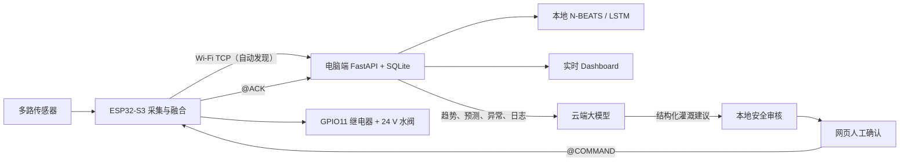

# ESP32-S3 智能灌溉：本地预测 + 云端大模型

本项目是面向 2026 年全国大学生物联网设计竞赛乐鑫科技赛道的离线优先智能灌溉系统。ESP32-S3 采集空气温湿度、气压、土壤温湿度、双路风速和双路太阳辐射；电脑端完成多传感器融合、SQLite 存储、N-BEATS/LSTM 本地预测、实时网页展示，并通过火山引擎 OpenAI 兼容网关调用真实云端大模型。云端建议必须经过本地安全审核，默认还需人工确认，最终才会通过 USB 串口控制 GPIO11 继电器。

官方赛题原文：[2026 乐鑫科技赛道 PDF](https://iot.sjtu.edu.cn/ueditor/net/upload/file/20260329/6391039317778793056390288.pdf)。

## 赛题必备项对照

| 官方必备项 | 本项目对应实现 | 现场验收证据 |
| --- | --- | --- |
| 使用 ESP32-S3/C5/P4 之一 | ESP32-S3 采集固件 | Arduino 编译/烧录日志和串口启动信息 |
| 至少 1 种传感器数据融合 | 空气、气压、土壤、双风速、双太阳辐射融合为统一 `SensorSnapshot` | dashboard 实时卡片、`@TELEMETRY` JSON、SQLite 历史 |
| 对接至少 1 个云端大模型 | 火山引擎 OpenAI 兼容网关，实际发起 HTTPS 请求 | 页面“云端已启用/已配置”、调用时间、延迟、Token 和模型回复 |
| 上行或下行交互 | 上行：趋势/预测/异常/灌溉日志交给大模型；下行：模型建议经审核和确认后控制水阀 | `llm_calls`、`decisions`、`@COMMAND`、ESP32 `@ACK` 和继电器动作 |

项目同时实现了赛题加分方向中的边缘计算、多源融合和节水应用。需要注意：仓库默认关闭真实云调用，正式验收时必须配置真实 Key、模型/推理接入点并完成一次成功调用；只有假数据测试不能证明已满足“对接云端大模型”。

## 离线主干 + 云端增强架构



断网时，传感器采集、SQLite、网页、本地预测和已有本地安全逻辑继续工作；云端问答和非实时分析降级为不可用，云端失败不会直接开阀。云端模型永远不直接访问 GPIO。

## 本地边缘风险、环境事件与安全动态采样

“边缘智能”运行在**电脑端本地边缘网关**，而不是宣称 ESP32-S3 运行神经网络。它将当前多传感器融合数据、历史趋势、本地 N-BEATS/LSTM 预测和水阀状态组合成可解释风险等级；ESP32-S3 只承担实时采集、快速安全保护和执行已审核的指令。

| 风险等级 | 典型依据 | 本地动作 |
| --- | --- | --- |
| `NORMAL` | 数据新鲜，环境稳定 | 常规监测 |
| `ATTENTION` | 传感器失败或实时数据陈旧 | 记录故障，禁止演示自动开阀 |
| `HIGH_EVAPOTRANSPIRATION` | 土壤偏干 + 高温 + 强光 + 较高风速 + 预测证据 | 记录综合证据，建议高频监测和低频云端分析 |
| `IRRIGATION_CANDIDATE` | 有效土壤湿度低于本地灌溉触发阈值 | 记录干旱候选；仍只产生建议，绝不无人值守开阀 |

SQLite 的 `environment_events` 记录事件代码、严重度、发生时间、证据、建议动作和恢复状态，并使用冷却时间去重。当前事件包括 `SOIL_ABNORMALLY_DRY`、`HIGH_EVAPOTRANSPIRATION_RISK`、`NIGHT_STABLE`、`SENSOR_FAILURE`、`DATA_INTERRUPTION` 和 `VALVE_EXECUTION_FAILURE`。页面的事件时间线和接口可审计这些记录。

| 采样模式 | 推荐间隔 | 使用条件 |
| --- | ---: | --- |
| `DEBUG` | 2 秒 | 上电默认、安全调试值 |
| `IRRIGATION_MONITORING` | 2–5 秒 | 灌溉候选、高蒸散或水阀已打开 |
| `NORMAL_MONITORING` | 30–120 秒 | 环境稳定的正常监测 |
| `NIGHT_ECO` | 5–15 分钟 | 低光、低风、土壤稳定且没有灌溉候选 |

采样策略只是“电脑端推荐 + ESP32 白名单执行”，不是实测功耗结论。固件**故意不使用 Deep Sleep**：水阀打开时必须保持 2–5 秒监测，且 ESP32 仍要接收关阀命令、维持 8 秒主机心跳超时关阀和最长开阀保护。每次重启都会回到 `DEBUG` / 2 秒，动态配置只保存在 RAM。

## 仓库结构

- `firmware/esp32_s3_all_sensors/`：ESP32-S3 传感器与安全水阀固件。
- `dual_forecast/`：数据桥接、存储、预测、云端交互和本地安全审核。
- `artifacts/`：已训练的 N-BEATS/LSTM 权重及标准化器。
- `tests/`：接口、假云网关、安全规则和串口闭环测试。
- `runtime/`：本机 SQLite、日志和 PID 文件，不提交 Git。

## 第一次安装与一键启动

要求 Python 3.10 或更高版本，推荐 Python 3.11/3.12。仓库自带模型权重，新电脑无需先训练。当前固件默认使用 **ESP32 → 同一 Wi‑Fi → 电脑接收器** 传输传感器数据；USB 用于烧录、查看日志和无法联网时的备用接收模式。ESP32 与电脑必须加入同一个 2.4 GHz 局域网/手机热点。

### Windows PowerShell

Wi‑Fi 数据链路的正常启动方式：

```powershell
cd C:\Users\你的用户名\Desktop\AIoT--ModelPredition
.\start_dashboard.cmd -Wifi -Lan
```

首次运行会创建 `.venv`、安装依赖、启动 FastAPI 与 Wi‑Fi 接收器，并用 Edge/Chrome 应用模式打开全屏页面。ESP32 加入同一 Wi‑Fi 后会周期性广播自己的 TCP 服务，接收器自动发现它；DHCP 换 IP、重启手机热点后都无需手填 IP。停止后台服务：

```powershell
.\stop_dashboard.cmd
```

上面的 `-Lan` 允许同一 Wi‑Fi 下的手机访问。若网络开启了“客户端隔离”并同时拦截局域网 UDP 广播，可用 ESP32 串口打印的 DHCP IP 强制指定：

```powershell
.\start_dashboard.cmd -Wifi -EspWifiHost 172.20.10.2 -Lan
```

手机与电脑连同一 Wi-Fi 后，在手机输入 `http://电脑IPv4:8000/dashboard`。Windows 防火墙弹窗只允许“专用网络”，不要在公共网络开启。无 Wi‑Fi 时可退回 USB：`.\start_dashboard.cmd -EspSerialPort COM3 -Lan`。

首次一键启动会检查火山引擎配置。没有 Key、Key 失效、模型不可用或网关不可达时，会在终端提示输入新的 VEI API Key（输入不回显），并保存到项目根目录的 `.env`。以后只需要运行同一条启动命令，不需要再次设置环境变量。`.env` 已被 Git 忽略，绝不能提交或发给他人；系统环境变量仍可覆盖其中配置，便于正式部署使用密钥管理服务。

PowerShell 里不使用 `source .venv/bin/activate`；脚本直接调用 `.venv\Scripts\python.exe`，不会误用 Anaconda 或全局 Python。

### Windows CMD

```cmd
cd C:\Users\你的用户名\Desktop\AIoT--ModelPredition
start_dashboard.cmd -Wifi -Lan
```

### macOS / Linux

macOS 一键启动：

```bash
cd /你的路径/AIoT--ModelPredition
./start_dashboard.sh --wifi
```

同一 Wi-Fi 的手机巡检演示需要显式加入 `--lan`：

```bash
./start_dashboard.sh --wifi --lan
```

然后在手机中打开 `http://本机IPv4:8000/dashboard`。默认会自动发现 ESP32，不需要查看或填写它的 DHCP IP。只有网络启用“客户端隔离”并同时禁止局域网广播时，才改用显式 IP：`./start_dashboard.sh --wifi --esp-wifi-host 172.20.10.2 --lan`。macOS 防火墙若提示，允许 Python 在本地网络通信。备用 USB 模式为 `./start_dashboard.sh --serial-port /dev/cu.wchusbserial10 --lan`。

首次执行启动命令时，若没有可用的火山引擎 Key，终端会让你粘贴一次（输入不回显）。它会先用极小的 `Reply exactly OK.` 请求验证 Key、模型和网关；此检查不生成灌溉建议，也不会控制水阀。验证成功后信息保存在本机 `.env`，以后启动无需重复输入。

需要主动换 Key 时，可单独运行：

```bash
.venv/bin/python -m dual_forecast.cli cloud-configure
```

停止：

```bash
./stop_dashboard.sh
```

`.env.example` 是变量清单。真实 `.env` 会被自动读取、优先级低于系统环境变量，并且已被 Git 忽略。真实 Key 只能放在本机 `.env` 或密钥管理系统中，不要写进源码、截图、SQLite 或 Git。`AIOT_DEMO_AUTO_EXECUTE` 仅为旧配置兼容项，不能再触发开阀；默认仍需要网页人工长按确认。

### 让云端分析理解农田

云端大模型只会依据本地服务整理的事实生成解释和建议，不能直接开阀。除实时数据、本地预测、风险事件和 1 小时/24 小时/7 天趋势外，可以在本机 `.env` 增加已知农田信息：

```dotenv
AIOT_FARM_CROP=番茄
AIOT_FARM_GROWTH_STAGE=开花结果期
AIOT_FARM_SOIL_TYPE=壤土
AIOT_FARM_PLOT_AREA_M2=12
AIOT_FARM_IRRIGATION_METHOD=滴灌
AIOT_FARM_NOTES=下午避免灌溉，优先傍晚短时补水
```

改完后重新运行 `./start_dashboard.sh --wifi --lan`。这些字段只增强云端解释，不会更改 ESP32、本地阈值、最长开阀时间或人工长按确认。没有填写的字段会明确传给模型为“未知”，不会由模型自行猜测。当前没有接入天气服务，模型也会明确说明不能据此判断降雨或天气预报。

## 手动启动与健康检查

需要排错时打开两个终端。终端 1：

```bash
python3 -m venv .venv
.venv/bin/python -m pip install -r requirements.txt
.venv/bin/python -m dual_forecast.cli serve --host 127.0.0.1 --port 8000
```

终端 2（端口替换为实际值）：

```bash
.venv/bin/python -m dual_forecast.cli receive-esp32 \
  --esp-host auto
```

`auto` 是默认值：电脑先监听 UDP 3334，ESP32 每 3 秒广播一次当前 TCP 地址，再自动连接 TCP 3333，因此 DHCP IP 变化不需要人工处理。部分手机热点会阻断 UDP 广播；此时接收器会自动回退到固件的 `esp32-sensors.local` mDNS 名称。若网络同时阻断广播和 mDNS，可把 `auto` 换成 ESP32 串口打印的 IP。Windows 将上面的 Python 路径写为 `.venv\Scripts\python.exe`。备用 USB 接收器命令为 `receive-esp32-serial --serial-port COM3`。检查服务：

```bash
curl http://127.0.0.1:8000/health
```

页面地址：`http://127.0.0.1:8000/dashboard`。实时卡片每 2 秒刷新；预测历史默认每 5 分钟入库一次。页面右上角不超过 5 秒且为绿色代表 ESP32 数据链路正常，超过 20 秒变红代表中断。

### 手机移动巡检与二维码

在以 `--lan` / `-Lan` 显式启动后，用电脑浏览器打开 Dashboard。页面二维码由本机 `GET /v1/dashboard/qr` 生成为 PNG，二维码内容使用浏览器正在访问的地址，**不调用第三方二维码网站，也不把临时 IP 写入源码**。手机扫二维码前应确认二者在同一 Wi-Fi；如果二维码不能识别局域网 IP，复制页面显示的地址并手动把主机名替换为电脑 IPv4。

手机页面包含实时传感器、边缘风险、采样状态、水阀状态、最近事件、报告摘要、文本问答和可选语音能力提示。Web Speech API / SpeechSynthesis 不可用时自动退回文字问答，页面与本地报告不依赖外网。页面的“确认灌溉”必须长按 1.5 秒，随后仍调用后端安全审核；摇一摇、语音、手势均不能直接开阀。

### 快速测试模式

正式模式需要 288 个五分钟点（约 24 小时）。仅验证采集、预测、决策和接口链路时，可以开启
快速测试模式：默认每 5 秒提交一次，收集 24 个点后开始预测，约 2 分钟可看到结果。

```bash
# 终端 1
make serve-fast

# 终端 2
make receive-fast
```

`make receive-fast` 默认使用 USB 串口，可通过 `SERIAL_PORT=/dev/cu.xxx make receive-fast`
指定端口。Wi-Fi 自动发现模式使用 `make receive-fast-wifi`。

也可以直接运行 `dual-forecast serve --fast-test --fast-test-samples 24` 和
`dual-forecast receive-esp32-serial --serial-port /dev/cu.xxx --fast-test --fast-test-interval-seconds 5`。
快速模式会在预测警告中显示 `FAST_TEST_MODE`。它把高频样本视为模型时间步，只用于验证
端到端流程，不能用于评价模型精度或替代正式的五分钟采样结果。

Windows 查看接收日志：

```powershell
Get-Content .\runtime\logs\esp32-receiver.out.log -Tail 40 -Wait
```

`-Wait` 会持续等待新日志，看似“卡住”是正常现象，按 Ctrl+C 退出。macOS 对应：

```bash
tail -f runtime/logs/esp32-receiver.out.log
```

## 云端分析、问答和安全灌溉

环境变量配置正确并重新启动服务后，dashboard 应显示云端“已启用、已配置”。

1. 点击“生成云端分析建议”，电脑将当前融合数据、最近 1/24 小时趋势、本地预测、异常和近 7 天灌溉统计发给大模型。
2. 在问答框输入“今天需要调整灌溉计划吗？”或“过去一周用了多少水？”，页面同时显示回答所依据的数据范围。
3. 若模型建议 `START_WATERING`，本地会先验证数据新鲜/完整、土壤阈值、置信度、过期时间、15 分钟冷却、单次 60 秒和每日 600 秒限制。
4. 默认状态是 `awaiting_confirmation`。点击“人工确认并下发”后，命令才进入 SQLite 队列。
5. 串口接收器发送 `@COMMAND`，ESP32 验证 Schema、TTL、动作白名单、持续时间和最新传感器状态，再把 GPIO11 拉高。
6. ESP32 返回 `@ACK`，网页显示 `OPEN`；达到持续时间后自动拉低 GPIO11并返回关闭 ACK。

### 可选：AI 建议后的自动灌溉

默认关闭。要让“本地预测 + 实时数据 → 云端 AI 建议 → 本地安全层 → ESP32 水阀”自动闭环，在本机 `.env` 写入并重启服务：

```dotenv
AIOT_AUTO_IRRIGATION_ENABLED=1
AIOT_AUTO_IRRIGATION_MIN_CONFIDENCE=0.80
AIOT_AUTO_IRRIGATION_REQUIRE_FORECAST_READY=1
```

自动模式下，AI 不能直接操作 GPIO。只有 `START_WATERING` 同时满足以下条件，电脑才会把命令加入 ESP32 队列：AI 置信度不低于阈值、ESP32 数据新鲜且全部有效、本地边缘判断为 `IRRIGATION_CANDIDATE`、本地预测状态为 `ok`、土壤湿度低于阈值、冷却时间/单次时长/每日总时长均符合限制，并在入队前再次复核。任一条件失败都会保留建议并写出原因，不开阀。云端不可用、模型输出错误或网络中断时固定为 `NO_OP`。

`STOP_WATERING` 是保守动作：仍需有效 AI 决策和本地命令 TTL，但不因预测尚在预热而阻止关阀。所有自动下发会显示为 `auto_confirmed_waiting_device`，命令和 ESP32 `@ACK` 仍会保存到 SQLite。首次启用时建议先断开 24 V 水阀，只观察继电器指示灯、命令队列和 ACK。

### 串口协议示例

设备上行：

```text
@TELEMETRY {"uptime_ms":123456,"wind":{...},"air":{...},"soil":{...},"solar":{...}}
```

电脑下行：

```text
@COMMAND {"schemaVersion":"1.0","requestId":"...","action":"START_WATERING","durationSeconds":30,"reasonCode":"SOIL_DRY","reason":"human-confirmed: ...","confidence":0.91,"expiresAt":"...","ttlSeconds":30}
```

设备确认：

```text
@ACK {"requestId":"...","accepted":true,"actualState":"OPEN","reason":"started","remainingSeconds":30}
```

安全动态采样使用**独立队列和独立协议**，绝不复用水阀 `@COMMAND`：

```text
@CONFIG {"schemaVersion":"1.0","requestId":"config-...","samplingMode":"NORMAL_MONITORING","readIntervalMs":60000}
@CONFIG_ACK {"requestId":"config-...","accepted":true,"samplingMode":"NORMAL_MONITORING","readIntervalMs":60000}
```

固件只接受四档白名单模式及对应范围；水阀打开时会拒绝慢采样或 `NIGHT_ECO`，并在 `@CONFIG_ACK` 返回 `valve_open_requires_fast_sampling`。`@CONFIG` 不会进入 `command_queue`，因此无法被误解析为开阀命令。

## 节水与运行报告

以下接口均可在云端关闭时使用：

| 接口 | 内容 |
| --- | --- |
| `GET /v1/dashboard/latest` | 当前快照、预测、边缘风险、事件、水阀与采样状态、报告摘要 |
| `GET /v1/events` | 环境事件时间线与恢复状态 |
| `GET /v1/edge/status` | 当前风险评估与最近配置 ACK |
| `GET /v1/reports/water` | 24 小时/7 天灌溉次数、时长、可选用水估算、数据质量、每日趋势 |
| `GET /v1/reports/daily` | 本地日报、风险、预测摘要、事件统计、传感器健康率 |

`AIOT_VALVE_FLOW_LPM` 仅在阀门标称/实测流量已知时配置；报告按 `开阀秒数 / 60 × 流量(L/min)` 计算**估算**用水量，并清楚标注不是水表实测。未配置时用水升数为未知，不会伪造 0 L。未定义对照基准或历史不足时，页面应显示“数据积累中”，不显示“节水 xx%”或具体电流/功耗节省率。

电脑端验证绝对时间 `expiresAt`，并且只发送未过期命令；ESP32 不依赖联网校时，使用 1–30 秒的传输 TTL、独立的最长 60 秒关阀计时器和 8 秒主机心跳超时保护。重复 `requestId` 不会重复执行。

## 全部硬件接线

| 功能 | ESP32-S3 引脚 | 传感器/模块侧 | 参数 |
| --- | --- | --- | --- |
| 风速 1 | GPIO9 ADC | 模拟信号 OUT | 0–5 V 输出必须先分压到 0–3.3 V |
| 风速 2 | GPIO6 ADC | 模拟信号 OUT | 同上 |
| AHT20 | GPIO5 / GPIO8 | SDA / SCL | 3.3 V，地址 0x38 |
| HW-611 BMP280 | GPIO3 / GPIO4 | SDA / SCL | 3.3 V；CSB→3.3 V；SDO→GND 时地址 0x76 |
| 土壤 RS485 转换器 | GPIO18 / GPIO17 | RO / DI | 4800 8N1，土壤地址 0x03，独立总线 |
| 太阳 RS485 转换器 | GPIO16 / GPIO15 | RO / DI | 4800 8N1，两个探头地址 0x01/0x02 并联在此总线 |
| 继电器控制 | GPIO11 | IN | 3.3 V 一路继电器，高电平有效 |
| Feather I²C 电源控制 | GPIO7 | 不外接 | 固件自动拉高，禁止复用 |

AHT20：VCC→3.3 V，GND→GND，SDA→GPIO5，SCL→GPIO8。BMP280：VCC→3.3 V、GND→GND、SDA→GPIO3、SCL→GPIO4、CSB→3.3 V、SDO→GND；若 SDO 拉高则通常是 0x77，固件也会回退扫描。

土壤探头虽然只暴露 VCC、GND、A、B，但 A/B 是 RS485 差分信号，仍需 3.3 V 逻辑兼容的自动收发 RS485 转换器，不能把 A/B 作为普通 UART 长期直连 ESP32。探头 A/B→转换器 A/B，转换器 RO→GPIO18、DI→GPIO17。太阳辐射使用另一块转换器：两个探头 A 对 A、B 对 B 并联，转换器 RO→GPIO16、DI→GPIO15。A/B 无响应时先核对说明书定义，必要时只在断电后互换 A/B。传感器电源按铭牌独立供电，不能因接口名字相同就接 ESP32 3.3 V。

继电器低压控制侧：模块 DC+/VCC→符合模块要求的 3.3 V 电源，DC-/GND→ESP32 GND，IN→GPIO11。24 V 常闭水阀的触点侧：24 V 电源正极→COM，NO→水阀正极，水阀负极→24 V 电源负极。这样继电器未吸合时水阀无电并保持关闭。COM/NO/NC 是隔离触点，可以切换 24 V，但必须确认触点额定直流电压/电流高于水阀负载；直流水阀线圈建议并联合适的续流二极管或抑制器。24 V 不得接入 ESP32 GPIO 或继电器 IN。

更详细固件说明见 `firmware/esp32_s3_all_sensors/README.md`。当前串口屏方案已停用，GPIO11 专用于继电器。

### ESP32 手机 Wi-Fi 配网（可选增强）

USB 仍是默认采集、预测和安全开阀主链路；ESP32 的 Wi-Fi 配网只解决“换到手机热点、Windows 热点或家用路由器时，无需改代码重烧录”的联网需求。首次烧录或 USB 串口发送 `@WIFI_RESET` 后，ESP32 开启一次性配置热点 `AIOT-SETUP-xxxxxx`，热点统一密码为 `12345678`，访问地址 `http://192.168.4.1/` 会输出到 USB 串口。手机连接后填写当前 **2.4 GHz** 普通 WPA2 网络的 SSID/密码，凭据仅保存在 ESP32 本机 NVS 中，随后通过 DHCP 自动取址。5 GHz、网页认证/扫码/验证码校园网不属于该通用配网范围；校园网 802.1X 需要单独适配学校认证方式。

完成配网不等于手机自动能访问 Dashboard。Dashboard 仍由电脑运行；让手机巡检时，使用 `-Lan` / `--lan` 启动，并让手机与电脑位于同一局域网后访问 `http://电脑IPv4:8000/dashboard`。

## 评委现场演示流程

1. 烧录固件并展示芯片识别为 ESP32-S3、GPIO11 上电 LOW。
2. 关闭 Arduino 串口监视器，一键启动 dashboard 和 USB receiver。
3. 展示多路实时传感器和统一 `@TELEMETRY`，拔掉一个传感器展示异常记录，再恢复。
4. 展示 SQLite 历史、本地 N-BEATS/LSTM 状态；未满 288 个五分钟样本时可解释为约 24 小时预热，也可使用已有连续历史演示完整预测。
5. 设置真实火山引擎环境变量，重启后展示页面“已启用、已配置”。
6. 点击云端分析并进行自然语言问答，展示真实调用时间、延迟、Token、回复和数据范围。
7. 让模型产生灌溉建议，展示其先停留在人工确认状态；确认后观察 `@COMMAND`、继电器动作和 `@ACK`。
8. 不等待也可看到最长 60 秒后自动关阀；拔掉 USB/停止心跳时，8 秒内安全关阀。
9. 断开互联网，再展示本地采集、网页、SQLite 和预测不受影响，云端请求明确降级为 `NO_OP`。

建议正式演示前先不接 24 V 水阀，只观察继电器指示灯和万用表通断，确认全部保护逻辑后再接负载。

## 数据和本地预测说明

`AirPressure` 以 hPa 接收，内部转为 kPa。模型保持 5 分钟时间格，连续 288 个完整点对应 24 小时输入窗口；ESP32 接收器默认每 30 秒提交一次完整包，因此同一个 5 分钟格可以由多条有效采样补齐。积累不足时显示 `warming_up`（页面显示为“连续完整数据积累中”）；遇到超过插值上限的缺口会跳过缺口前的断裂时间段，从下一条连续完整数据重新计数，而不会返回 `insufficient_data`。不完整数据仍用于实时安全判断和异常记录，但不会污染预测历史；下一条完整数据可立即继续入库。

### ESP32 轻量边缘预测（断网降级）

完整的 N-BEATS + 两层 LSTM 继续在电脑本地边缘网关运行；它依赖 PyTorch 权重和 24 小时历史窗口，不直接移植到 Arduino。ESP32-S3 同时每 5 分钟运行一次轻量、可解释的干燥趋势估计，输入为空气温湿度、气压、土壤湿度、太阳辐射和可用风速，输出：

- 未来 30 分钟土壤湿度估计；
- 预计干燥速率（%/h）；
- `NORMAL` / `ATTENTION` / `DRY_RISK` / `SENSOR_INVALID` 风险等级及原因。

该结果会作为 `edge_prediction` 随 ESP32 JSON telemetry 发送，并显示在网页“ESP32 边缘预测（断网降级）”卡片中。它只用于离线趋势提示、传感器异常可见性和答辩中的边缘计算演示，**不会绕过电脑端安全规则，也不会直接打开 GPIO11 水阀**。

完整预测接口为 `GET /v1/forecast/latest`，服务重启后从 `runtime/forecast.sqlite3` 恢复历史。若 BMP280 暂时上报 0，接收器默认临时使用 1013 hPa 作为预测回退值；安全审核仍以实时有效性为准。

模型训练为可选操作：

```bash
.venv/bin/python -m dual_forecast.cli preprocess '虹桥2018-2024逐小时气象数据.zip'
.venv/bin/python -m dual_forecast.cli train-all '虹桥2018-2024逐小时气象数据.zip' --epochs 35
```

虹桥数据不含真实土壤湿度，初始 LSTM 使用桶式水量平衡和虚拟灌溉事件生成代理序列，不能把该指标解释为真实土壤预测精度。积累至少 14 天有效土壤观测后可运行 `retrain-observed --epochs 35`，再调用 `POST /v1/models/reload` 热更新模型。

## 测试与固件编译

```bash
.venv/bin/python -m pytest -q
arduino-cli compile \
  --fqbn esp32:esp32:adafruit_feather_esp32s3_nopsram \
  --build-path /tmp/aiot-esp32-build \
  firmware/esp32_s3_all_sensors
```

仓库未提交原始气象 ZIP，因此测试中依赖该 ZIP 的两项数据处理测试会跳过，其余云网关、安全规则、API、串口和预测流程仍会运行。假网关测试不会访问互联网或消耗 Token，也不能替代正式验收中的真实云调用。
