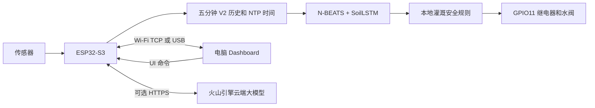

# ESP32-S3 智能灌溉

这是一个离线优先的智能灌溉系统。**ESP32-S3 是唯一的生产业务节点**：采集、五分钟历史、N-BEATS/SoilLSTM 推理、灌溉安全规则、水阀执行和可选云端大模型都在设备上完成。电脑或手机网页只是显示数据和转发用户操作；它们断开、关机或无互联网时，ESP32 的采集、预测和本地自动灌溉仍可继续运行。

官方赛题：[2026 乐鑫科技赛道 PDF](https://iot.sjtu.edu.cn/ueditor/net/upload/file/20260329/6391039317778793056390288.pdf)。

## 生产架构


```mermaid
flowchart LR
  S[传感器] --> E[ESP32-S3]
  E --> H[五分钟 V2 历史和 NTP 时间]
  H --> M[N-BEATS + SoilLSTM]
  M --> R[本地灌溉安全规则]
  R --> V[GPIO11 继电器和水阀]
  E <-->|Wi-Fi TCP 或 USB| D[电脑 Dashboard]
  D -->|UI 命令| E
  E <-->|可选 HTTPS| C[火山引擎云端大模型]
```

- ESP32 本地规则始终优先于云端建议。云端只能解释、问答和给出建议，不能绕过设备安全门或直接操作 GPIO11。
- 自动灌溉每次重启均关闭，需在 Dashboard 中人工启用；即使已启用，设备仍会校验 NTP 时间、完整传感器、288 点连续窗口、冷却时间和单次最长 60 秒（按升数闭环为主，时长作为最终硬超时兜底）。
- PC 端不运行生产预测、不做生产决策、不调用云端，也不保存或索取云端 API Key。训练和模型导出仍是开发工具，和日常 Dashboard 启动无关。

## 一键启动 Dashboard

仅需 Python 3.10+。首次启动会建立 `.venv` 并安装网页/串口接收依赖；**不检查云端 Key，也不读取 `artifacts/` 模型文件**。

### Windows

Wi-Fi 接收（推荐）：

```powershell
cd C:\Users\你的用户名\Desktop\AIoT--ModelPredition
.\start_dashboard.cmd -Wifi -Lan
```

USB 接收：

```powershell
.\start_dashboard.cmd -EspSerialPort COM3 -Lan
```

`-Lan` 让同一局域网中的手机访问 `http://电脑IPv4:8000/dashboard`。Windows 防火墙仅允许“专用网络”。停止后台进程：

```powershell
.\stop_dashboard.cmd
```

### macOS / Linux

Wi-Fi 接收（自动发现 ESP32）：

```bash
cd /你的路径/AIoT--ModelPredition
./start_dashboard.sh --wifi --lan
```

USB 接收：

```bash
./start_dashboard.sh --serial-port /dev/cu.wchusbserial10 --lan
```

若热点屏蔽 UDP 广播和 mDNS，可将串口打印的设备 IP 显式传入：

```bash
./start_dashboard.sh --wifi --esp-wifi-host 172.20.10.2 --lan
```

## Dashboard 的职责

Dashboard 从设备接收 `@TELEMETRY`、`@FORECAST`、`@IRRIGATION_STATE`、`@CLOUD_RESULT` 和 `@UI_ACK`，将最近状态缓存到 SQLite 后展示。网页按钮只写入待转发的 `@UI_COMMAND`；ESP32 收到后必须再次审核，再返回 ACK。

```text
网页按钮 -> 电脑转发 @UI_COMMAND -> ESP32 安全审核 -> @UI_ACK / @IRRIGATION_STATE -> Dashboard
```

因此“打开水阀”按钮只是请求，不能保证已经打开。以设备返回的 `@UI_ACK` 和 `@IRRIGATION_STATE` 中的阀门状态为准；`STOP_WATERING` 是任何状态下都允许的保守操作。

电脑断开后重新连接，Dashboard 只请求设备当前状态与后续遥测，不会把 PC 上陈旧的预测或决策下发给设备。

## ESP32 离线采集与预测

设备上电默认是 `OFFLINE_LOGGING`，每 **5 分钟**保存一个完整样本。任一必需传感器失败时，该 slot 不写入；设备每 15 秒重试，跨过 slot 仍失败则形成缺口，连续预测窗口从下一条完整样本重新累计。

- 连续 288 个五分钟样本为 24 小时窗口。满足后 ESP32 运行 float32 N-BEATS 和两层 SoilLSTM，输出下一小时 ET₀ 与 12 个五分钟土壤湿度预测点。
- 本方案不使用硬件 RTC。设备每次上电必须先成功连接互联网并完成 NTP 校时；Wi-Fi 连通后约 5 秒开始校时重试。当前运行周期内可继续离线采集、预测和自动灌溉，但断网重启后会回到 `clock_unset`，直到下一次 NTP 校时。
- `warming_up`、`clock_unset` 或模型错误时，可显示轻量 `edge_prediction` 风险提示；它不能直接开阀。
- 记录采用 V2（二进制版本、长度、连续序号、UTC epoch、slot、传感器有效标志和 CRC）。启动会恢复最新连续 288 条 V2 数据；不会要求再次等待 24 小时。

### 升级旧日志

V1 离线记录与 V2 不兼容。升级前先通过 USB 导出旧记录：

```bash
dual-forecast offline-log --action export
```

确认 CSV 已保存并检查后，再使用交互式二次确认或显式 `erase` 清除旧 V1 文件。固件不会静默删除或伪造迁移旧记录。

## 云端大模型

云端是可选增强，设备在有互联网时通过 HTTPS 直接访问火山引擎 OpenAI 兼容网关。API Key、是否启用、模型名和农田档案均由 ESP32 配网页面保存到设备 NVS：

- Key 不回显、不写入串口日志、遥测、SQLite 或 Git。
- 配网页面只显示“已配置”；提交空 Key 时保留现有 Key，清除需要显式操作。
- 网络、TLS、JSON 或网关失败只产生设备状态，**不影响**本地采集、预测和安全控制。
- 曾经暴露在终端、聊天记录或截图中的 Key 必须在正式部署前作废并重新生成。

电脑侧 `.env` 不再是云端配置位置。电脑没有网络时仍能显示设备数据；ESP32 所在局域网若没有互联网，则设备照常离线运行，云端请求显示为不可用即可。

## 硬件接线

| 功能 | ESP32-S3 引脚 | 接线/说明 |
| --- | --- | --- |
| 风速（当前使用） | GPIO6 ADC | OUT；若模块输出 0–5 V，必须分压到 0–3.3 V |
| 风速预留 | GPIO9 | 当前不接、不采样 |
| AHT20 | GPIO5 / GPIO8 | SDA / SCL，3.3 V，I²C 地址 0x38 |
| HW-611 BMP280 | GPIO3 / GPIO4 | SDA / SCL，3.3 V；CSB→3.3 V；SDO→GND 通常为 0x76 |
| ZH-SOIL7 土壤 | GPIO18 / GPIO17 | 设备 TTL UART 的 RX / TX，4800 8N1，Modbus-RTU 地址 0x03 |
| SN-300AL 太阳辐射 | GPIO16 / GPIO15 | 经自动收发 RS485 转换器的 RO / DI；4800 8N1，地址 0x01/0x02 |
| 水阀继电器 | GPIO11 | IN，3.3 V 单路继电器，高电平有效；上电默认 LOW |
| YF-S201 流量计 | GPIO12 | 黄色脉冲 OUT 经 5 V→3.3 V 电平转换后接入；红线外部 5 V，黑线 GND |
| Feather I²C 电源控制 | GPIO7 | 不外接，禁止复用 |

土壤传感器这一版是 **TTL UART 电气层**，不是 RS485 电气层：模块的 TX 接 ESP32 GPIO18（RX），模块的 RX 接 ESP32 GPIO17（TX），并与 ESP32 共地。它传输的帧格式仍可以是 Modbus-RTU；“Modbus-RTU”是通信协议，不能据此判断必须使用 RS485。

太阳辐射总线才使用 RS485：两个探头 A 对 A、B 对 B 并联，接到独立的自动收发 RS485 转换器；转换器 RO→GPIO16，DI→GPIO15。太阳 1（0x01）是反射短波，太阳 2（0x02）是入射短波，净短波为 `max(入射 - 反射, 0)`。

本方案没有硬件 RTC。设备仅在 NTP 校时成功后将 ESP32 系统时钟视为可信时间；当前运行周期内即使暂时断网仍可继续采集、预测和自动灌溉，但断网重启后必须再次联网校时。

水阀的低压侧：继电器 DC+/VCC 接模块要求的 3.3 V，DC-/GND 与 ESP32 共地，IN 接 GPIO11。24 V 常闭水阀的触点侧：24 V 正极→COM，NO→水阀正极，水阀负极→24 V 负极。确认继电器触点的直流额定值高于负载；24 V 不能进入 ESP32 GPIO 或继电器 IN。

YF-S201 接线：红线接稳定的 5 V 电源，黑线接电源负极并与 ESP32 GND 共地，黄线是脉冲输出，不能把 5 V 直接接到 ESP32。推荐用 10 kΩ 串联到 GPIO12、GPIO12 再用 20 kΩ 接 GND；如果实际模块是开集电极输出，可在 GPIO12 节点增加 3.3 V 上拉。传感器箭头方向按水流方向安装。固件按 f = 7.5 × Q 计算，其中 f 是 Hz，Q 是 L/min；没有水流时 0 L/min 是正常值，累计量按约 450 脉冲/L 统计。

### 按升数闭环灌溉

正式灌溉（START_WATERING / CONFIRM_WATERING / 自动模式）不再只看开阀时长，而是按本次目标升数闭环：

$$V_{target} = \frac{ET_0 \times K_c \times A}{\eta}$$

其中 ET₀ 取设备下一小时预报（mm），Kc 为作物系数，A 为灌溉面积（m²），η 为灌溉效率；因为 1 mm 水覆盖 1 m² 等于 1 L，单位直接换算为 L。演示默认：番茄、开花结果期、面积 0.01 m²（一平方分米）、Kc=1.15、η=0.90、滴灌、YF-S201 标定 450 脉冲/L。目标量小于等于 0 时不启动；小于 1 L 按实际值执行，不强制补足。

开阀后 ESP32 用 YF-S201 脉冲换算实际出水量，达到目标升数立即关阀（`volume_reached_closed`）；开阀 8 秒仍无新脉冲则判 `FLOW_FAULT` 并安全关阀，故障不永久锁死、下次候选可重试；单次正式灌溉最长 300 秒硬超时。调试开阀（DEBUG_VALVE_PULSE）仍固定 5 秒，不参与流量闭环、不计入正式冷却与统计。0 L/min 本身不是故障。

## ESP32 配网

无已保存网络、首次烧录或收到 `@WIFI_RESET` 时，ESP32 建立 `AIOT-SETUP-xxxxxx` 热点，密码为 `12345678`，在 `http://192.168.4.1/` 配置 2.4 GHz WPA2 网络。网络凭据和云端配置仅保存在 ESP32 NVS。普通手机热点、Windows 移动热点和家用路由器可用；5 GHz、网页认证/验证码和多数 802.1X 校园网需要专门适配。

## 开发：训练与模型导出

训练只在开发电脑进行；生产 Dashboard 启动不需要 `artifacts/`。模型更新后执行导出，再重新烧录 ESP32：

```bash
.venv/bin/python scripts/export_esp32_models.py
.venv/bin/python scripts/export_esp32_models.py --check
```

导出生成 `firmware/esp32_s3_all_sensors/generated/model_data.h`，其中包含 float32 权重、标准化器、模型版本和 SHA-256。不要手改该文件。

### Arduino 依赖与编译

Arduino IDE / `arduino-cli` 需安装 **ArduinoJson 7.4.2**。板型选择 `Adafruit Feather ESP32-S3 No PSRAM`，分区选择 `Default (3MB APP/1.5MB SPIFFS)`：

```bash
arduino-cli compile \
  --fqbn 'esp32:esp32:adafruit_feather_esp32s3_nopsram:PartitionScheme=default_8MB,CDCOnBoot=default,UploadMode=default' \
  --build-path /tmp/aiot-esp32-build \
  firmware/esp32_s3_all_sensors
```

详细固件协议与离线日志操作见 [firmware/esp32_s3_all_sensors/README.md](firmware/esp32_s3_all_sensors/README.md)。
